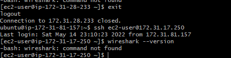

# Documentation of project 12

## STEP 1
1. I created a directory, named it "ansible-config-artifact" and changed the permission.
   `sudo mkdir /home/ubuntu/ansible-config-artifact`
   `chmod -R 0777 /home/ubuntu/ansible-config-artifact`

   

2. I installed "copy artifacts from my jenkins web console"
  
   

3. I created a freestyle project and named it "save_artifacts"

    

4. I configured my freestlye project for it to trigger builds from ansible builds

    
    

5. I confirmed if my files are in the ansible-config-artifact directory

    
     

6. I created a role path for ansible in "etc/ansible/ansible.cnf"

   `sudo vi /etc/ansible/ansible.cnf`

   

7. I created a file; "common-del.yml" in my static-assignments directory
    
    

8. I confirmed if my ansible command was runing

   `ansible all -m ping`
       
       

9.  I ran my playbook to delete wireshark and it worked

    `ansible-playbook -i /home/ubuntu/ansible-config-artifact/inventory/dev.yml /home/ubuntu/ansible-config-artifact/playbooks/site.yml`

    

10. I confirmed if wireshark has been deleted on all instances connected

    
    
    
    
    

11. I launched two new instances and named it "web1-uat" and "web2-uat"
   
     

12. I created a webserver role

     

13. I edited my ansible.conf file

    

14.  I commited and pushed all changes to my github repository

     

15. I manually checked if my webservers are okay
      
      `uat-webserver -m ping`
    

16. I run my ansible-playbook command and it worked

    

17. These are the commands in my files
    
    
    
    
    
